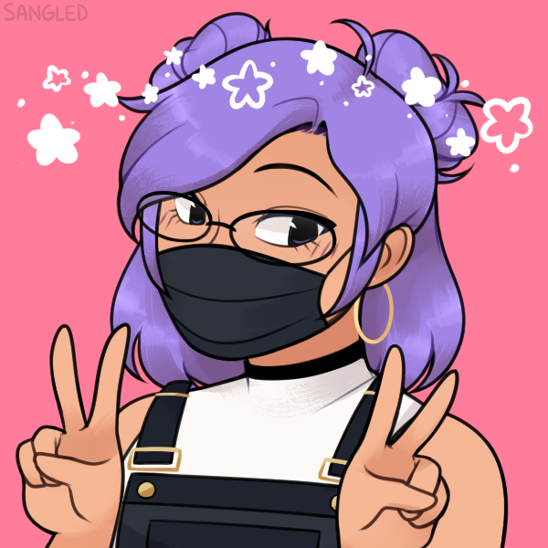

#Bem Vindos (a) ao meu repositório de idéias.

- 💻 Trabalho  Atualmente em busca da minha primeira oportunidade na área.
- 🕮 Estudando: MRV Fullstack Developer (DIO)
- 📥 Entre em contato comigo pelo E-mail: grazydev@gmail.com 

  <a href="https://github.com/GrazyDev">
  
  
  

 
    
    
   
   
  

##
 

 

  

  

   